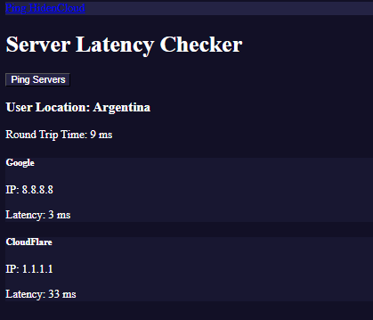
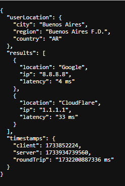

# Ping Service with Frontend and Backend

## Overview
This project is a simple implementation of a ping service that measures latency to various server locations. It consists of a backend server built with Node.js and a frontend web interface. The service provides:

- Real-time ping data from multiple servers.
- Accurate latency measurement using timestamps.
- Display of user location based on IP address.

## Features
- **Backend:**
  - Uses `express` for the API server.
  - Pings server locations and calculates average latency.
  - Provides round-trip time by synchronizing timestamps between the client and server.
  - Retrieves user location using their IP address.

- **Frontend:**
  - A responsive web interface built with Bootstrap.
  - Displays server latencies and user location in a user-friendly format.

## Technologies Used
- **Backend:** Node.js, Express, `ping` package, `geoip-lite`.
- **Frontend:** HTML, JavaScript, Bootstrap 5.

## Installation

### Prerequisites
- Node.js installed on your machine.
- Basic knowledge of JavaScript and web development.

### Steps
1. Clone the repository:
   ```bash
   git clone <https://github.com/PistonCube/HidenCloud-PING.git>
   ```

2. Navigate to the project directory:
   ```bash
   cd <HidenCloud-PING>
   ```

3. Install dependencies:
   ```bash
   npm install
   ```

4. Create a configuration file:
   - Create a file named `config.json` in the `data` folder.
   - Define the servers and port:
     ```json
     {
       "port": 3000,
       "servers": [
       { "location": "Google", "ip": "8.8.8.8" },
       { "location": "CloudFlare", "ip": "1.1.1.1" }
       ]
     }
     ```

5. Start the server:
   ```bash
   npm start
   ```

6. Open the web interface:
   - Visit `http://localhost:3000/ping` in your browser.

## Usage

### User Flow
1. Access the web interface.
2. Click the **Ping Servers** button.
3. View the latency results and user location displayed on the page.

### API Endpoint
- **GET** `/ping`
  - Parameters:
    - `timestamp`: The client's current timestamp (in milliseconds).
  - Response:
    - `userLocation`: The user's location based on their IP.
    - `results`: Array of ping results for each server.
    - `timestamps`: Object with `client`, `server`, and `roundTrip` times.

## Frontend Example
Below is a screenshot of the frontend interface:



## Backend Example
Here is how the backend processes requests:



## Project Structure
```plaintext
.
├── backend                 # Backend folder
│   ├── data                # Data/configuration files
│   │   └── config.json     # Server details
│   ├── index.js            # Main backend script
│   ├── package.json        # Node.js dependencies
│   └── package-lock.json   # Dependency lockfile
├── frontend                # Frontend folder
│   ├── assets              # Static assets (CSS, JS, etc.)
│   └── index.html          # Frontend entry point
├── img                     # Images folder
│   ├── backend.png         # Backend-related image
│   ├── frontend.png        # Frontend-related image
│   └── logo.png            # Project logo
├── LICENSE                 # License file
└── README.md               # Documentation

```

## Future Improvements
- Add support for WebSocket to enable real-time updates.
- Implement more robust error handling.
- Include visual graphs for latency trends.

## License
This project is licensed under the MIT License.

---

For any questions or issues, please contact discord: PistonCube.

